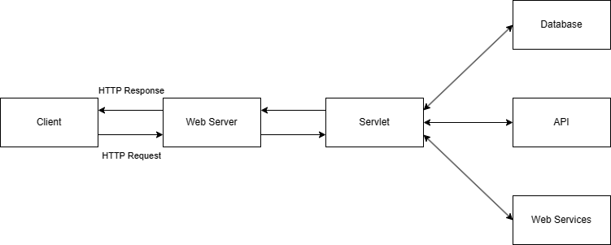

### JDBC 
Java Database Connectivity (JDBC) is an application programming interface (API) for the programming language Java, which defines how a client may access a database. It is a Java-based data access technology used for Java database connectivity. It is part of the Java Standard Edition platform, from Oracle Corporation. It provides methods to query and update data in a database, and is oriented toward relational databases. A JDBC-to-ODBC bridge enables connections to any ODBC-accessible data source in the Java virtual machine (JVM) host environment.
### Role of JDBC Driver 
JDBC tries to minimize the number of details that a developer needs to worry about. A common approach to this goal is to specify the layers at which various common activities occur and then to tightly define how those layers will interact with one another and with a program.
JDBC takes this approach. JDBC specifies that most of the details about communicating with a database system will be handled through a software layer called a driver. This driver will handle the details of the three basic tasks we need to do to work with a database:
1. Create and maintain a connection to a database
2. Send our commands to that database
3. Deliver the database response back to our program

### JDBC Driver-jar file
 in order for Java applications working with a database engine via Java Database Connectivity (JDBC), an appropriate JDBC driver library is required to be available in the application’s classpath. A JDBC driver library consists of Java classes which implement low-level communication with the database engine. It talks with Java applications via JDBC API and usually bundled as a JAR or ZIP file.
 
For your reference and convenience, i provides a summary of JDBC driver download for common databases including MySQL, SQL Server, Oracle, PostgreSQL, Apache Derby (Java DB), SQLite and Microsoft Access. If you use Maven, see the Maven dependencies for those JDBC drivers below.

|  Database | JDBC Driver Provider  |  JAR file name |
| ------------ | ------------ | ------------ |
|  MySQL |  Oracle Corporation |  mysql-connector-java-VERSION.jar |
|  SQL Server | Microsoft Corporation  | sqljdbc41.jar, sqljdbc42.jar  |
|  Oracle | Oracle Corporation  | ojdbc6.jar, ojdbc7.jar, ojdbc8.jar  |
| PostgreSQL  |  The PostgreSQL Global Development Group | postgresql-VERSION.jar  |
|  Apache Derby |Apache Software Foundation   | derby.jar, derbyclient.jar  |
| SQLite  |Xerial.org   |  sqlite-jdbc-VERSION.jar |


### Generation of JDBC Drivers


### Steps for connecting JDBC
- loading driver
- establishing connection
- creating statement or prepered statement

#### Code Snippet to Connect the Java application with Oracle database

```java
import java.sql.*;
class JDBCDemo
{
     public static void main(String args[])
     {
          try
          {
               //Load the driver
               Class.forName("oracle.jdbc.driver.OracleDriver");
    
               //Cretae the connection object
               Connection con = DriverManager.getConnection("jdbc:oracle:thin:@localhost:1521:XE","username", "password");
    
               //Create the Statement Object
               Statement stmt = con.createStatement();
    
               //Excute the SQL query
               ResultSet rs = stmt.executeQuery("Select * from students");
               while (rs.next())
               {
                    System.out.println (rs.getInt(1)+" "+rs.getString(2)+" "+rs.getFloat(3));
               }
               //Closing the connection object
               con.close();
               stmt.close();
               rs.close();
          }
          catch(Exception e)
          {
               System.out.println(e);
          }
     }
}
```


## Servlet

Servlet is a Java backend package for processing requests and generating responses in a Java based web application. It extends the functionality of a webserver by providing a way to dynamically generate web content. servlet is one of the component APIs of Java Platform Enterprise Edition which sets standards on many features such as distrubuted computing and webservices. Using this package, developers are able to create asyncronous, dynamic webpages that are more powerful than pervious Java web applications.

### Advantages of Servlets

 - Platform Independent: servlets can be run on any web server that supports the servlet API, regardless of the underlying operating system or hardware.

 - Scalability and Performance: servlets are designed to handle multiple concurrent requests efficiently. It effectively handles threads and is computationally less expensive compared to other server architectures. In addition, servlets have a smaller memory footprint compared to full fledged Java web servers

 - Portability: servlets follow the Java Servelet API specifications. This allows servlet based applications to be easily deployed to different web servers without rewriting code.

 - Developer Suport: Servlets are part of the Java Platform Enterprise Edition which provides a wide range of libraries, frameworks, and tools for building web applications. Developers can utilize these resources to create additional features and functionalities.

 ### How do Servlets Work

 Servlets are not a webserver, but programs that handle clients requests obtained from the webserver. Servlets process this request and forward the respective response to the webserver. The webserver essentially acts as a proxy from the client to the Servlet program. When the Servlet receives a request from the web server, it can generate a response by pulling information from many different sources such as Databases, APIs, and other web services before sending its response.

 
 *Servlet Server Architecture*

The Servlet is masnaged by a Servlet Container. Servlet containers provide services such as session/ cookie management, security services, and managing servlet lifecycle. The lifecycle of a Servlet is important to understanding how a Servlet operates. There are three main stages in the Servlet Life Cycle.

 - Initialization: Initalization for any resources the Servlet may need.
 - Request Handling: Handles incoming requests to the Servlet
 - Destruction: Handles how the servlet will be destroyed

 The Servlet is first started when a container calls its *init()* method. This starts up the Servlet, initializing any parameters such as API keys or authentication information. When the Servlet has been initilized, the servlet is ready to accept incomming requests. Based on *HTTP* request type, the client's request will be forwareded to the respective method such as *doPost()* and *doGet()*. When the Servlet is ready to be shut down the *destroy()* method is called allowing the Servlet to gracefully shutdown.

 ### How to use Servlets

```Java

import java.io.*;
import javax.servlet.*;
import javax.servlet.http.*;


public class ExampleServlet extends HttpServlet {

     public void init() throws ServletException {
          // Any require initilization

     }

     public void destroy() {
          // Any required cleanup when Servlet is destroyed

     }

     protected void doGet(HttpServletRequest request, HttpServletResponse response) throws ServletException, IOException {
          // Example get request handler - Can also do other methods like POST, HEAD, and DELETE

          // Set response header content-type to text/html
          response.setContentType("text/html");

          // TODO - Get information from a Database, API, or other Web Service

          PrintWriter out = response.getWriter();

          // Output html body
          out.print("<html><body>");
          out.print("<h1>Example HTML output</h1>");
          out.print("</body></html>");

     }
}
```

*Example Servlet Program*

